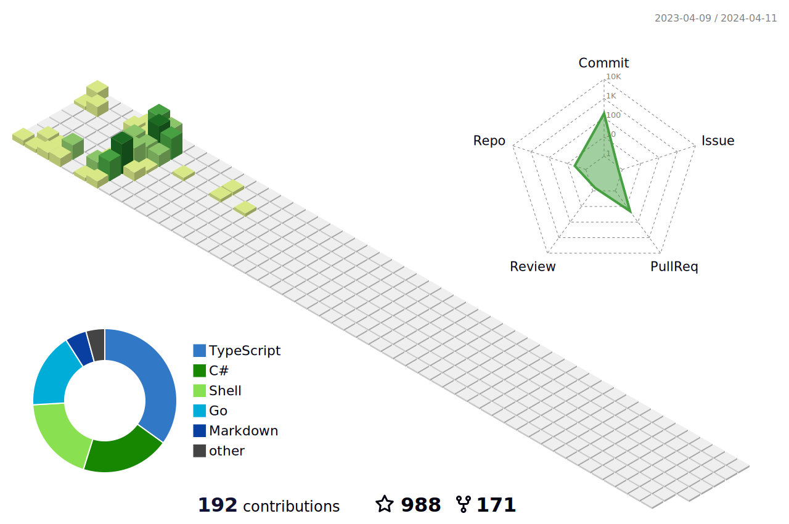

<h1 align="center">☁️ Hi there </h1>

  

    
  

  

     
    <h3>My Name is Ekta Bharti | I am a B.Tech CSE Student | Specialization in Cloud Computing and Information Technology | Interest in Full Stack Development</h3>
  

 

  

    
    
    
    
    
    
  

#### About me

- 🔭 I’m currently working on **FYP_home**

- 🌱 I’m currently learning **GCP & DevOps Tools**

- 💬 Ask me about **AWS, HTML, CSS, JS, React, JAVA, C**

- 📫 How to reach me: **[ektabharti235@gmail.com](mailto:ektabharti235@gmail.com)**

- 👩‍💻 Check out my Google Cloud Skills Boost profiles:
  - [Profile 1](https://www.cloudskillsboost.google/public_profiles/bed239f1-64fb-4990-9d85-8e1a6b963d0a)
  - [Profile 2](https://www.cloudskillsboost.google/public_profiles/be53a506-374c-4a48-b72b-d09337457e95)

  

<h3 align="left">Languages and Tools:</h3>

    
    
    
    
    
    
    
    
    
    
    
    

&nbsp;

<!-- Until that day: https://user-images.githubusercontent.com/22963968/159836902-a7553777-f1e2-49ed-90fc-9721322b3f44.png -->
<!-- The betrayer: https://user-images.githubusercontent.com/22963968/155458995-e4c24fff-d667-48cd-a1ce-1f66cd233a14.png -->
<!-- The world ender: https://user-images.githubusercontent.com/22963968/130322172-4e4996cd-eb3d-4013-9fc2-47e573413310.png -->
<!-- Farewell Miura: https://user-images.githubusercontent.com/22963968/119890439-1ff29f00-bf38-11eb-8515-d0a9c3c8a6b6.png -->
<!-- First steps with JavaScript: https://user-images.githubusercontent.com/22963968/114021347-e3c48b80-9870-11eb-8bc8-998bf39b4d0d.png -->

